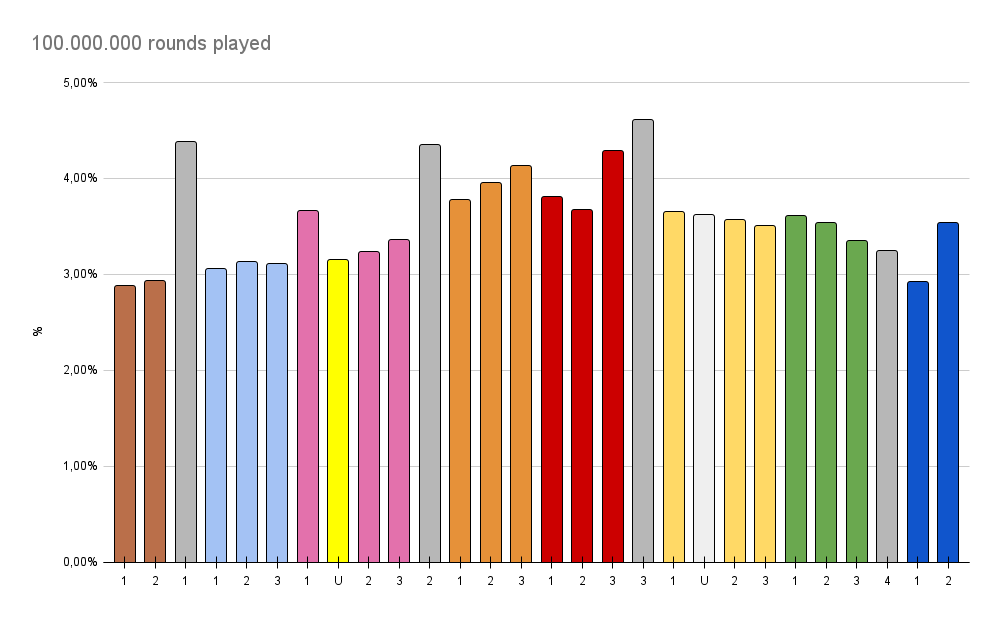

## Desciption
MonopolyAnalizer is a script designed to simulate thousands of rounds of Monopoly gameplay to gather data on the probabilities of landing on each space on the board. By analyzing these outcomes, the program provides the statistical chances of landing on specific properties, helping players understand the game's dynamics better.
